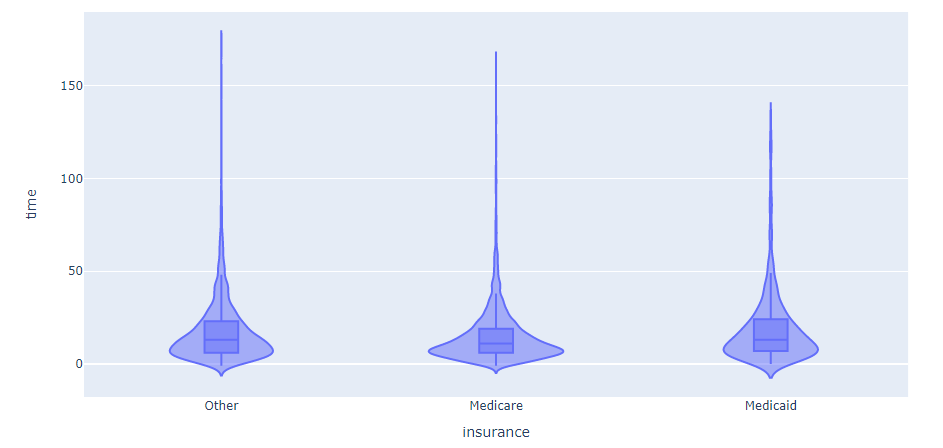

# Project of Data Visualization (COM-480)

| Student's name | SCIPER |
| -------------- | ------ |
| Jeremy Dezalos | 283885 |
| Hojjat Karami | 332629|
| Léonard Vaney | 284023 |

[Milestone 1](#milestone-1) • [Milestone 2](#milestone-2) • [Milestone 3](#milestone-3)

## Milestone 1 (23rd April, 5pm)

**10% of the final grade**

### Dataset

[MIMIC-IV](https://physionet.org/content/mimiciv/2.2/) is a publicly available dataset containing de-identified electronic health record data from over 2 million ICU patients at Beth Israel Deaconess Medical Center from 2008 to 2019. It includes vital signs, lab results, medications, and clinical notes, and can be used for clinical research and machine learning.

Sepsis is a life-threatening condition caused by the body's response to an infection. It can cause widespread inflammation, organ failure, and septic shock. Early recognition and treatment are crucial for a positive outcome.

We filtered the MIMIC-IV dataset, which has data from over 60,000 ICU patients, to select only those who have at least one ICD code that contains the word "sepsis." This resulted in approximately 8,000 patients being included in our analysis.

### Problematic

Electronic health records (EHRs) pose several challenges related to data management and analysis. One significant challenge is managing multi-modality data, which may include diverse types of data such as imaging, audio, and text data. Time-series and event sequence data is also common in EHRs, but presents challenges in terms of analysis and modeling due to the complexity of temporal relationships. EHRs often contain heterogeneous data, meaning that different data types are collected and stored in different formats, and may be of varying quality. Additionally, EHRs contain data on different disease subtypes, and understanding the unique characteristics and patterns of these subtypes is a complex task. Addressing these challenges requires sophisticated data management techniques, as well as advanced data and visual analytics that can accommodate these diverse data types and structures and provide insights into specific disease subtypes.

We are interested in acquainting students with patient data in electronic health records (EHRs). To achieve this, we will develop several visual analytics tools that can facilitate exploring the dataset by adopting recent advancements in visual analytics technology. These visual tools will provide students with insights into the data and help them understand the underlying patterns and trends.

Based on our literature review, we have identified several components that we plan to develop in our project. These components include:

* A global overview of the entire dataset.
* Interactive subset selection, allowing the user to select a subset of the data by interacting with the overview panel.
* The ability for the user to specify desired outcomes, such as length of stay, specific diseases (using ICD codes), or in-hospital mortality.
* A simple clustering algorithm (e.g. K-means) to show potential patient subgroups. The user should be able to select two subgroups for further analysis.
* A panel utilizing recent "event sequence simplification" algorithms to show differences in medication order for each subgroup.
* A panel to show aggregated trends and temporal patterns in clinical variables, such as laboratory and vital values, for each subgroup.

### Exploratory Data Analysis

The dataset contains 7889 admissions that contains an ICD code that is related to sepsis. This exploratory data analysis will focus on the patients themselves and will try to explain who they are.

Top 15 ICD codes are illustrated in the pie chart below. we can see that `severe sepsis with septic shock` is the most frequent icd code in our dataset followed by other sepsis-relevant icd codes.

The age repartition of this cohort is this:

We can see that no one has a age between 0 and 20. This is because the dataset has been anonymized to attempt at the privacy of the subjects. Thus, every person with an age less than 20 is represented as being 0 years old. So without even if we do not know what a spesis is we can already deduce that it affects patients of all ages.

Let's look at the outcome of the patients at the end of their stay at the hospital. We defined an outcome as positive if the patient survived their stay.

Because sepsis is a life-threatening condition, around two thirds of the patients do not survive their stay (In the graph, label 0 means being dying and label 1 means surviving).

The time of the stay is also useful to understand the patient's financial status. One could argue that wealthy patients stay longer at the hosptial because they can afford to pay the expanses longer compared to poorer patients.

Let's look at the distribution of time stayed given the patient's insurance

We notice that the patients using medicare have a shorter stay in the hospital than patients who have other insurances. Medicaid is an health insurance for people with limited income or resources. This tends to verify our hypothesis that poorer people leave the hospital faster to reduce the cost of their bills.

Ethnicity is also an attribute available in the database. Let's look at how they are represented.

White people are the most represented in the cohort. This representation is coherent because the hospital is situated in Boston.

Ethnicity can potentially correlate with other values such as time of stay or outcome.

It is difficult to determine a correlation between the time and the ethnicity of the patient. So let's look at the mortality ratio given the ethnicity.

We can see that people with unspecified ethnicity have higher chances to survive. The unable to obtains column only 74 people so we do not consider this to be significant. However the people who have an unknown ethnicity are almost eight hundred and we still do not have a good explanation for this.

### Related work

This database has been used extensively for analysis or for tool testing. [Here](https://www.ncbi.nlm.nih.gov/pmc/articles/PMC7192440/) is a link to a paper that provides a detailed analysis of MIMIC-III.

We used as a base point for our visualizations an interesting paper on the state-of-the-art EHR visualization ([Link here](https://onlinelibrary.wiley.com/doi/full/10.1111/cgf.14424)). Section 4 contains some links to other papers with useful visualizations such as events sequence simplification, clustering or cohort comparison.

Some examples below:

[EventFlow](https://ieeexplore.ieee.org/abstract/document/6634100)
Transform temporal events into an aggregated display to identify hidden trends in the data.

[OutFlow](https://ieeexplore.ieee.org/abstract/document/6327272)
Visualization of temporal event sequence data.

[CoCo](http://fandu.org/papers/malik2014vis.pdf)
Tool for comparing groups (cohorts) of temporal event sequence data.

[DICON](https://gotz.web.unc.edu/research-project/dicon/)
Visualization tool to explore similarity in cohorts of patients. 

The originality of our project lies in the fact that we want to make the exploration of this dataset understandable and usable by students or inexperienced users with EHR data and to give them useful insights on this dataset.

## Milestone 2 (7th May, 5pm)

**10% of the final grade**

### Visualization

The website will be divided in panels. Each panel will cover the entirety of the screen and the user will be able to change panels by scrolling. The scrolling will always go to the next panel and not stop between panels.

There will be four panels in our core visualization:

- An introduction panel that will explain the goal of the visualization and the dataset used.
- A panel that will contain time series of a few manually selected patients. The time series will how much time a patient stayed in a ward. The purpose of this panel is to gently introduce the users to the data by showing patients with interesting data while not overloading them with information. When clicking on a ward displayed in the time series, a new panel is created below and the screen will scroll automatically to it.
- This new panel will contain events that happened when the patient was in the ward that was clicked.
- The last panel will implement EventFlow, which was described in milestone 1. It will contain dropdown menus that will contain drugs, ICD codes or measures. Below the EventFlow visualization will be displayed and will only show the patients that match all the fields selected in the forementioned dropdown menus.
When clicking on an event of the visualization, the same event of patients will be centered and aligned on the time series.

### Tools

### Goal breakdown

## Milestone 3 (4th June, 5pm)

**80% of the final grade**

## Late policy

- < 24h: 80% of the grade for the milestone
- < 48h: 70% of the grade for the milestone
